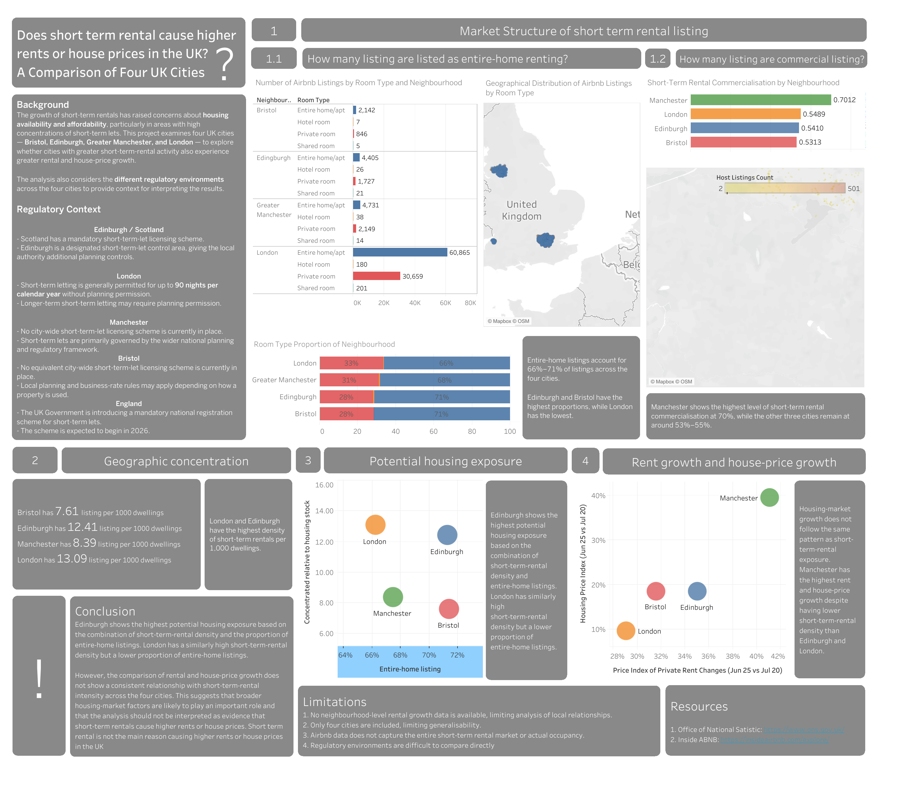

# UK Short-Term Rental Exposure and Housing Market Growth Analysis
[Dashboard](https://public.tableau.com/app/profile/ka.yan.chong/viz/AnalysingShorttermrentalactivitiyandpotentialhousingpressureinUKcities/Dashboard3)


## 1. Objective

This project examines the relationship between **short-term rental activity and housing-market growth** across four UK cities: Bristol, Edinburgh, Greater Manchester and London

The main objectives are to:
1. Measure the **scale and composition** of the short-term rental market.
2. Identify areas with higher concentrations of short-term rentals relative to the local housing stock.
3. Examine the relationship between **short-term rental intensity, rental price growth, and house-price growth** over a five-year period.
4. Consider differences in the **regulatory environment** when interpreting the results.

The analysis is intended to provide a data-driven view of whether cities with greater short-term rental activity also experienced greater growth in rents and house prices.

---

## 2. Background

The growth of short-term rentals has raised concerns about housing availability and affordability, particularly in areas with high concentrations of short-term lets.

This project examines four UK cities to explore whether cities with greater short-term rental activity also experienced greater rental and house-price growth.

The analysis considers several indicators of short-term rental exposure, including:
* The proportion of **entire-home listings**
* The concentration of listings relative to the local housing stock
* The proportion of listings associated with hosts managing multiple properties
* The geographical distribution of short-term rentals

The project also considers differences in the regulatory environments across the four locations to provide context when interpreting the results.

---

## 3. Regulatory Context
| Location | Regulatory context |
|---|---|
| **Edinburgh / Scotland** | Scotland has a mandatory short-term-let licensing scheme. Edinburgh is a designated short-term-let control area, giving the local authority additional planning controls. |
| **London** | Short-term letting is generally permitted for up to **90 nights per calendar year** without planning permission. Longer-term short-term letting may require planning permission. |
| **Manchester** | No city-wide short-term-let licensing scheme is currently in place. Short-term lets are primarily governed by the wider national planning and regulatory framework. |
| **Bristol** | No equivalent city-wide short-term-let licensing scheme is currently in place. Local planning and business-rate rules may apply depending on how a property is used. |
| **England** | The UK Government is introducing a mandatory national registration scheme for short-term lets. The scheme is expected to begin in 2026. |

> **Note:** Regulatory information is included as contextual information rather than as a direct explanatory variable in the statistical analysis.
---

# 4. What I Analyse

The analysis is organised around three main questions.

### 4.1 How commercialised is the short-term rental market?

I examine the proportion of listings associated with hosts who list more than one property.

A **Commercialised Index** is calculated as:

```text
Listings associated with hosts listing more than one property
----------------------------------------------------------------
Total short-term rental listings
```
A higher value indicates a greater proportion of listings associated with multi-property hosts.
---

### 4.2 Where is short-term rental activity concentrated?

I examine:
* Number of short-term rental listings
* Listing density relative to housing stock
* Geographical distribution of listings
* Proportion of entire-home listings

Particular attention is given to areas where short-term rental activity is high relative to the size of the local housing market.

---

### 4.3 How does short-term rental activity compare with housing-market growth?

I compare short-term rental exposure with:

* **Private rental price growth**
* **House-price growth**
* Short-term rental concentration

The housing-market indicators are calculated using changes in the relevant price indices over approximately five years.

The purpose is to identify whether the four locations show a **consistent relationship** between short-term rental intensity and housing-market growth.

This analysis is observational and does not attempt to establish a causal relationship.

---

# 5. Data Sources

This project uses data from two main sources.

(1) Office for National Statistics (ONS)
The ONS data includes indicators relating to Housing Price Index, Private rental price index and Dwelling stock

(2) Inside Airbnb
Inside Airbnb provides short-term rental listing data containing variables including Neighbourhood group, Neighbourhood, Latitude, Longitude, Room type, Calculated host listings count, Reviews, Availability

More information:
* [Office for National Statistics](https://www.ons.gov.uk/)
* [Inside Airbnb](https://insideairbnb.com/explore/)
* [Raw data](https://github.com/Meowcky/Short-Term-Rental-Exposure-and-Housing-Market-Growth/tree/main/data)

---

# 6. Technologies

| Purpose            | Technology  |
| ------------------ | ----------- |
| Data cleaning      | SQL / MySQL |
| Data analysis      | SQL / MySQL |
| Data visualisation | Tableau     |
| Data format        | CSV         |

The project primarily uses **SQL** for data cleaning, transformation and analysis before creating aggregated datasets for Tableau.

---

# 7. Data Analysis Process

## Step 1 — Data Cleaning

The raw CSV files were imported into MySQL staging tables before cleaning and analysis.

### Main operations

* Import raw data into staging tables
* Identify and remove duplicate records
* Create unique record IDs
* Create cleaned analysis tables
* Select relevant variables for analysis
* Standardise selected neighbourhood values
* Preserve the original staging data for reference

### Example: Removing Duplicate Records

Duplicate records were identified by comparing all relevant original fields rather than relying only on the listing ID.

```sql
INSERT INTO listinglondonstage2 (
    id,
    name,
    host_id,
    host_profile_id,
    host_name,
    neighbourhood_group,
    neighbourhood,
    latitude,
    longitude,
    room_type,
    price,
    minimum_nights,
    number_of_reviews,
    last_review,
    reviews_per_month,
    calculated_host_listings_count,
    availability_365,
    number_of_reviews_ltm,
    license
)
SELECT
    id,
    name,
    host_id,
    host_profile_id,
    host_name,
    neighbourhood_group,
    neighbourhood,
    latitude,
    longitude,
    room_type,
    price,
    minimum_nights,
    number_of_reviews,
    last_review,
    reviews_per_month,
    calculated_host_listings_count,
    availability_365,
    number_of_reviews_ltm,
    license
FROM (
    SELECT *,
           ROW_NUMBER() OVER (
               PARTITION BY
                   id,
                   name,
                   host_id,
                   host_profile_id,
                   host_name,
                   neighbourhood_group,
                   neighbourhood,
                   latitude,
                   longitude,
                   room_type,
                   price,
                   minimum_nights,
                   number_of_reviews,
                   last_review,
                   reviews_per_month,
                   calculated_host_listings_count,
                   availability_365,
                   number_of_reviews_ltm,
                   license
               ORDER BY id
           ) AS row_num
    FROM listingLondonStage1
) AS duplicate_cte
WHERE row_num = 1;
```

### Creating a Unique Record ID

```sql
ALTER TABLE listinglondonstage2
ADD COLUMN record_id INT FIRST;

SET @row_number = 0;

UPDATE listinglondonstage2
SET record_id = (@row_number := @row_number + 1)
ORDER BY id, name, host_id;

ALTER TABLE listinglondonstage2
ADD UNIQUE (record_id);
```

### Creating a Clean Analysis Table

Only variables required for the analysis were retained in the clean tables.

```sql
INSERT INTO listingLondonCleanDrop (
    record_id,
    id,
    host_id,
    host_profile_id,
    neighbourhood_group,
    neighbourhood,
    latitude,
    longitude,
    room_type,
    calculated_host_listings_count
)
SELECT
    record_id,
    id,
    host_id,
    host_profile_id,
    neighbourhood_group,
    neighbourhood,
    latitude,
    longitude,
    room_type,
    calculated_host_listings_count
FROM listinglondonstage2;
```

The same general cleaning process was applied to the other locations.

---

# 8. SQL Analysis

## Part 1 — Individual Location Analysis

### 8.1 Proportion of Room Types

The following query calculates the number and proportion of each room type.

```sql
SELECT 
    room_type,
    COUNT(room_type) AS 'Room type count',
    SUM(COUNT(record_id)) OVER () AS 'Total listing',
    ROUND(
        COUNT(record_id) / SUM(COUNT(record_id)) OVER () * 100,
        2
    ) AS 'Percentage'
FROM listingLondonCleanDrop
GROUP BY room_type
ORDER BY room_type;
```

This allows the analysis to identify the proportion of listings that are:

* Entire homes/apartments
* Private rooms
* Shared rooms
* Other room types where applicable

The **entire-home listing share** is used as an indicator of potential housing exposure because entire homes may represent properties that could otherwise be available as conventional housing.

---

## 8.2 Commercialised Index

The commercialisation measure is based on the number of properties listed by a host.

Hosts with:

```text
calculated_host_listings_count = 1
```

are treated as hosts listing one property.

Listings associated with:

```text
calculated_host_listings_count > 1
```

are treated as listings from multi-property hosts.

The index is calculated as:

```sql
SELECT 
    neighbourhood AS 'Neighbourhood',
    
    SUM(
        CASE 
            WHEN calculated_host_listings_count = 1 THEN 1
            ELSE 0
        END
    ) AS 'No. of people listing 1 property',
    
    COUNT(record_id) AS 'Total listing',
    
    ROUND(
        SUM(
            CASE 
                WHEN calculated_host_listings_count = 1 THEN 0
                ELSE 1
            END
        ) / COUNT(record_id),
        2
    ) AS 'Commercialised index'

FROM listingLondonCleanDrop
GROUP BY neighbourhood
ORDER BY neighbourhood ASC;
```

The resulting index ranges from 0 to 1.

For example:

```text
0.70 = 70% of listings are associated with hosts listing more than one property.
```

This is a **proxy for commercialisation**, rather than a direct measure of whether a property is commercially operated.

---

## 8.3 Geographic Distribution

Listings associated with multi-property hosts can be extracted using:

```sql
SELECT 
    latitude,
    longitude,
    room_type,
    calculated_host_listings_count
FROM listingLondonCleanDrop
WHERE calculated_host_listings_count != 1;
```

These data are used to examine the geographical distribution of potentially commercialised short-term rentals in Tableau.

---

# 9. Combining Data Across Locations

After analysing each location individually, summary tables were created to combine the results across the four locations.

### Room Type Summary

```sql
INSERT INTO AirbnbRoomTypeSummary (
    neighbourhood_group,
    neighbourhood,
    room_type,
    room_type_count,
    total_listing,
    percentage
)

SELECT 
    neighbourhood_group,
    neighbourhood,
    room_type,
    COUNT(record_id) AS room_type_count,
    SUM(COUNT(record_id)) OVER () AS total_listing,
    ROUND(
        COUNT(record_id) / SUM(COUNT(record_id)) OVER () * 100,
        2
    ) AS percentage
FROM listingLondonCleanDrop
GROUP BY neighbourhood_group, neighbourhood, room_type

UNION ALL

SELECT 
    neighbourhood_group,
    neighbourhood,
    room_type,
    COUNT(record_id),
    SUM(COUNT(record_id)) OVER (),
    ROUND(
        COUNT(record_id) / SUM(COUNT(record_id)) OVER () * 100,
        2
    )
FROM listinggreatermanchestercleandrop
GROUP BY neighbourhood_group, neighbourhood, room_type

UNION ALL

SELECT 
    neighbourhood_group,
    neighbourhood,
    room_type,
    COUNT(record_id),
    SUM(COUNT(record_id)) OVER (),
    ROUND(
        COUNT(record_id) / SUM(COUNT(record_id)) OVER () * 100,
        2
    )
FROM listingedinburghdropclean
GROUP BY neighbourhood_group, neighbourhood, room_type

UNION ALL

SELECT 
    neighbourhood_group,
    neighbourhood,
    room_type,
    COUNT(record_id),
    SUM(COUNT(record_id)) OVER (),
    ROUND(
        COUNT(record_id) / SUM(COUNT(record_id)) OVER () * 100,
        2
    )
FROM listingsbristolcleandrop
GROUP BY neighbourhood_group, neighbourhood, room_type;
```

This creates a consistent structure that can be used for comparison across the four locations.

---

# 10. Aggregate Tables for Visualisation

The final SQL tables were aggregated to provide Tableau with analysis-ready datasets.

For example:

```sql
SELECT
    r.neighbourhood_group,
    r.percentage AS `Entire-home listing`,
    c.commercialised_index AS `Commercialised index`
FROM LondonRoomTypeSummary r
JOIN LondonCommercialisedSummary c
    ON r.neighbourhood_group = c.neighbourhood_group
WHERE r.room_type = 'Entire home/apt';
```

These aggregated tables reduce the amount of transformation required in Tableau and ensure that the main calculations are performed consistently in SQL.

---

# 11. Data Visualisation

The final datasets were imported into **Tableau** to create interactive dashboards.

The visualisations focus on:

* Short-term rental distribution
* Room-type composition
* Entire-home listing share
* Commercialisation
* Short-term rental concentration relative to housing stock
* Rental price growth
* House-price growth
* Comparison between short-term rental exposure and housing-market growth
  
[Tableau link](https://public.tableau.com/app/profile/ka.yan.chong/viz/AnalysingShorttermrentalactivitiyandpotentialhousingpressureinUKcities/Dashboard3)

---

# 12. Conclusion

The analysis shows differences in short-term rental exposure across the four locations.

**Edinburgh shows the highest potential housing exposure** based on the combination of short-term-rental density and the proportion of entire-home listings. London also has a high short-term-rental density, but a lower proportion of entire-home listings.

However, the comparison of rental and house-price growth does **not show a consistent relationship** with short-term-rental intensity across the four locations.

This indicates that the relationship between short-term rentals and housing-market outcomes is more complex than a simple association between higher short-term rental activity and higher housing-price growth.

The results are consistent with the possibility that **broader housing-market factors also play an important role** in determining rental and house-price growth. Therefore, the findings should not be interpreted as evidence that short-term rentals cause higher rents or house prices.

Similarly, the analysis does not establish that short-term rentals have no effect on housing costs. More detailed data and a larger study would be required to isolate the effect of short-term rentals from other factors affecting housing markets.

---

# 13. Limitations

| Limitation                            | Description                                                                                                                                                                                                                                                 |
| ------------------------------------- | ----------------------------------------------------------------------------------------------------------------------------------------------------------------------------------------------------------------------------------------------------------- |
| **Limited neighbourhood-level data**  | Rental growth data was not available for all four locations, limiting local-level analysis.                                                                                                                                                                 |
| **Limited number of locations**       | Only four UK locations are analysed, so findings may not generalise to other areas.                                                                                                                                                                         |
| **Airbnb data coverage**              | Inside Airbnb covers Airbnb only, not the full short-term rental market. Listings also do not show actual occupancy, revenue, or year-round availability. Therefore, listing counts indicate **potential short-term rental exposure**, not actual activity. |
| **Different regulatory environments** | The four locations have different planning and regulatory frameworks, which also change over time and are difficult to compare directly.                                                                                                                    |

